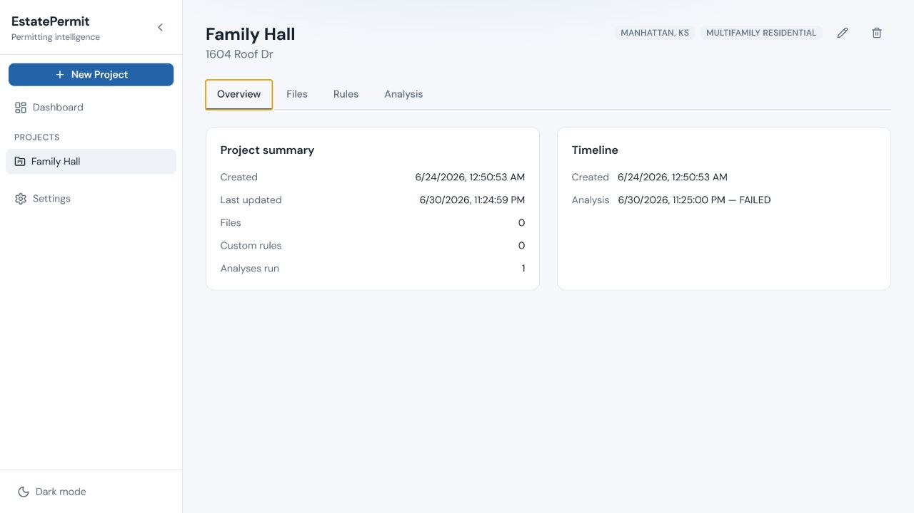
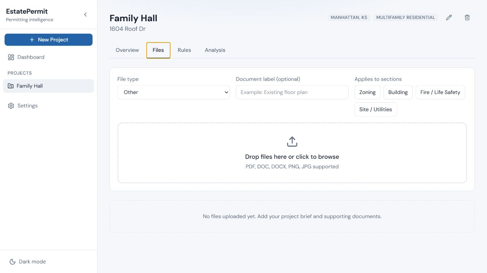
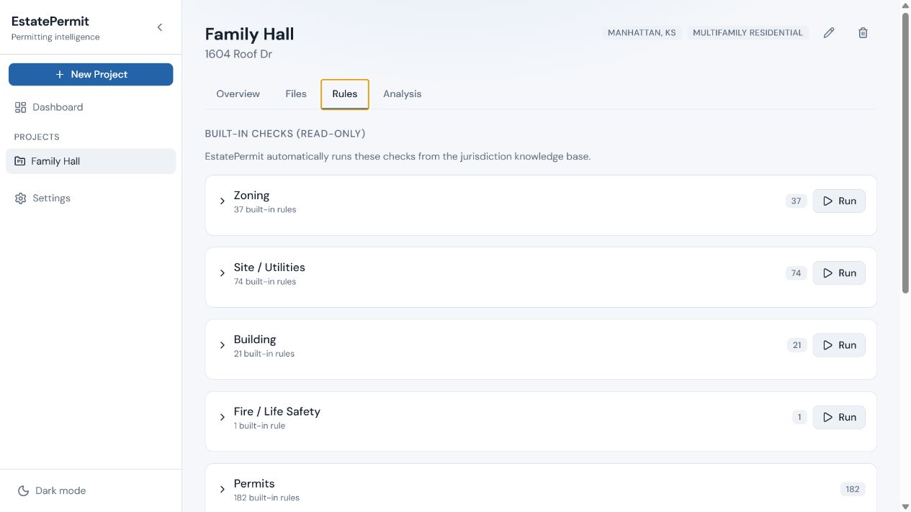
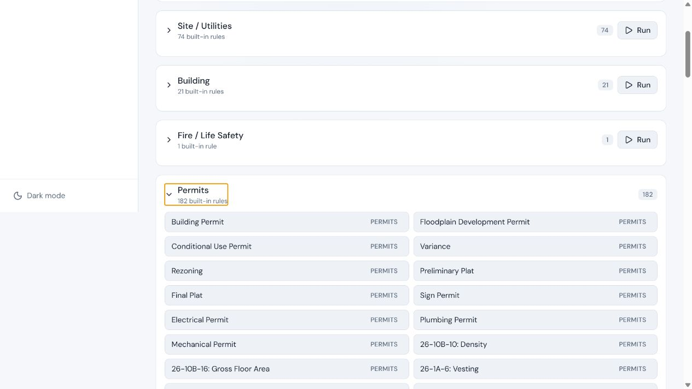
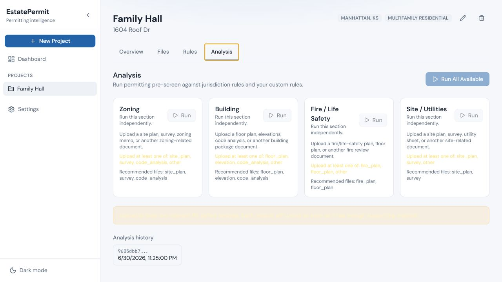

# EstatePermit project workspace structure audit

## Scope

Reviewed the current project experience at `Family Hall`: Overview, Files, Rules, the expanded Permits rule group, and Analysis. The audit focuses on information architecture, user comprehension, and visible accessibility risks. No product code was changed.

## Overall verdict

The current interface exposes the internal review engine as the product structure. Users see hundreds of rules divided into zoning, site/utilities, building, fire, and permits, then run analysis by the same disciplines. This makes it difficult to answer the contractor's central questions: Which permits do I need? What does each permit require? What is missing? What should I do next?

The clearest correction is to make permits the primary work objects and keep rules as underlying city-pack logic. Zoning, building, fire, and site/utilities should appear as review disciplines on findings, not as peer navigation destinations beside permits.

## Captured flow

### 1. Project overview - weak



The overview reports counts and history but not permit status, missing requirements, blockers, or the next action. It does not summarize the actual permitting work.

### 2. Files - mixed



Upload is clear, but users must manually decide which internal analysis sections a file applies to. Documents should normally be mapped to a permit and requirement; the system can infer review disciplines.

### 3. Rules and permits - structurally incorrect





The rules screen treats permits as one rule category alongside zoning and building. The expanded Permits group mixes actual permits with zoning-code sections such as density and gross floor area. That prevents a trustworthy permit checklist and makes the count of 182 rules meaningless to an end user.

### 4. Analysis - weak



Analysis repeats the discipline-based structure and asks users to run sections. Contractors need one project review action, followed by findings organized by urgency and permit. The pale yellow warning text also appears low contrast and needs measured accessibility testing.

## Recommended project navigation

1. **Overview** - project identity, jurisdiction, overall readiness, permits, blockers, and next actions.
2. **Permits** - likely, confirmed, dismissed, and manually added permits; each permit has its own readiness and lifecycle.
3. **Documents** - the project document library, mapped to permit requirements with versions and review status.
4. **Review** - all findings and missing items, grouped by permit and labeled by discipline.
5. **Activity** - comments, tasks, decisions, submissions, corrections, inspections, and status history.

Inspections can begin inside permit details and become a top-level project tab later if pilots show that users manage enough inspections to justify it.

## Recommended permit detail

Each permit should open into:

1. **Summary** - why the permit is needed, department, submission route, status, readiness, next action, and sources.
2. **Requirements** - application forms, plans, calculations, licenses, prerequisites, fees, and other required items.
3. **Documents** - files satisfying those requirements, including versions and review state.
4. **Review findings** - failed, warning, passed, and not-applicable checks grouped by discipline.
5. **Timeline** - submission, corrections, resubmission, issuance, inspections, and closeout.

## Correct role of rules

Rules should remain in the system but not as a normal customer-facing project tab.

- **Applicability rules** determine which permits may be required.
- **Requirement rules** determine what each permit needs.
- **Validation rules** review project facts and documents for compliance or inconsistencies.
- **Workflow rules** determine prerequisites, dependencies, and lifecycle actions.
- **Company/project checks** capture non-government requirements entered by the customer.

Customers should see the results and explanations of these rules. Administrators and reviewers may have a separate city-pack/rule-management area where they can inspect and maintain the underlying logic.

## Recommended relationship model

```text
City pack
  -> permit catalog
  -> applicability rules
  -> permit requirements
  -> validation rules and official sources

Project
  -> confirmed permit instances
      -> requirements
          -> supporting documents
          -> findings / issues
      -> submission and inspection timeline
```

One validation finding may affect the whole project or one or more permits. For example, a zoning setback finding may block a building permit, while an electrical document issue may only block the electrical permit.

## Highest-impact changes

1. Replace the **Rules** tab with **Permits**.
2. Replace **Analysis** with **Review** and one primary **Review project** action.
3. Stop showing rule counts as the main measure; show permit readiness, missing requirements, blockers, and next action.
4. Separate actual permit types from code sections in the city-pack data.
5. Map uploaded files to permits and requirements rather than asking users to understand internal analysis modules.
6. Rename **Custom rules** to **Project requirements** or **Company checks**, and keep them visually distinct from official city requirements.
7. Apply only relevant rules based on city, work scope, project facts, and confirmed permits; do not imply every rule runs against every project.

## Evidence limits

This was a screenshot and DOM-based review of the available sample project. It did not test a completed analysis, document upload, correction workflow, keyboard traversal, screen-reader output, responsive breakpoints, or measured color contrast. Those require separate interaction and accessibility testing.
