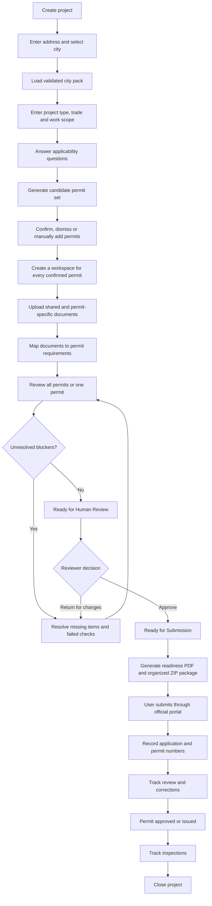

# EstatePermit Five-Step MVP Implementation Plan

## Product direction

EstatePermit will be one city-agnostic permitting workspace. Every project selects its city and jurisdiction. The selected city activates a local **city pack** containing its permit catalog, applicability questions, requirements, sources, portal links, workflow stages, and inspection guidance.

Kansas City, Missouri will be the first deeply validated city pack. Kansas City is selected by the user; it is never hard-coded as the default jurisdiction for every project.

The product must distinguish between:

- The complete catalog of permits available in a city.
- The candidate permits that might apply to a project.
- The permits confirmed as required for that project.
- The requirements and documents belonging to each confirmed permit.
- The review findings blocking each permit.

Selecting a city does **not** automatically make every permit in that city required. EstatePermit uses the project type, trade, work description, project facts, exemptions, dependencies, and follow-up questions to identify the likely permit set.

## Primary user outcome

A contractor should be able to:

1. Create a project and select its jurisdiction.
2. Describe the project and work scope.
3. Discover which permits are likely required.
4. Confirm, dismiss, or manually add permits.
5. Understand what every confirmed permit requires.
6. Upload shared and permit-specific documents.
7. Identify missing items, inconsistencies, and blockers.
8. Obtain human approval that the package is ready for submission.
9. Export an organized submission-readiness package.
10. Track submission, corrections, issuance, inspections, and closeout.

## Complete project flow



## Project navigation

The primary project sections will be:

### Overview

Show:

- Project identity and address.
- Selected city and jurisdiction.
- Project type, trade, and work scope.
- Overall readiness.
- Confirmed and possible permits.
- Project blockers and overdue items.
- Upcoming deadlines and inspections.
- The single most important next action.

### Permits

Show a card for every candidate and confirmed permit. Each card should include:

- Permit name.
- Applicability status.
- Explanation of why it was suggested.
- Coverage or confidence label.
- Readiness status.
- Number of missing requirements.
- Number of unresolved blockers.
- Lifecycle status.
- Responsible person.
- Next action.

Supported applicability statuses:

- Likely
- Required by confirmed facts
- Needs confirmation
- Confirmed
- Manually added
- Dismissed
- Not applicable

### Documents

Maintain one project document library containing:

- Shared project documents.
- Permit-specific documents.
- Unassigned documents.
- Document versions.
- Review state.
- Connections to permit requirements.

A document may satisfy requirements for multiple permits. The user should upload it once and link it to every relevant requirement.

### Review

Provide one actionable findings queue across the project. Allow filtering by:

- Permit.
- Requirement.
- Document.
- Review discipline.
- Severity.
- Status.
- Owner.

Zoning, building, fire, site, utilities, and company checks are review disciplines. They should not be separate competing project workflows.

Primary actions:

- **Review All Permits**
- **Review This Permit**

### Activity

Maintain a chronological record of:

- Comments.
- Tasks.
- Decisions.
- Document changes.
- Review runs.
- Human approvals.
- Submission events.
- Corrections.
- Resubmissions.
- Inspections.
- Status changes.

## Structure inside each permit

Every confirmed permit receives its own workspace.

### Permit summary

- Why the permit is needed.
- Department or authority.
- Official source.
- Submission route.
- Dependencies on other permits.
- Coverage level.
- Readiness.
- Lifecycle status.
- Owner.
- Next action.

### Requirements

Group requirements into:

- Application forms.
- Plans and drawings.
- Calculations.
- Contractor and license information.
- Supporting records.
- Prerequisites.
- Fees, where validated.
- Submission conditions.
- Inspections and closeout requirements.

Requirement statuses:

- Missing
- Uploaded
- Needs review
- Accepted
- Not applicable
- Blocked

### Permit documents

- Files satisfying each requirement.
- Current and previous versions.
- Shared-document links.
- Review state.
- Extracted facts requiring confirmation.

### Review findings

- Blockers.
- Warnings.
- Passed checks.
- Not-applicable checks.
- Source explanations.
- Recommended actions.
- Required human decisions.
- Accepted exceptions.

### Timeline and inspections

- Submission date.
- Application or permit number.
- Assigned reviewer.
- Expected response date.
- Corrections.
- Resubmissions.
- Approval or issuance.
- Scheduled inspections.
- Inspection results.
- Reinspections.
- Closeout.

## Role of the rules engine

Rules remain an important internal capability, but **Rules will not be a normal customer-facing project tab**.

EstatePermit will maintain:

- **Applicability rules:** determine which permits might be required.
- **Requirement rules:** determine what each permit needs.
- **Validation rules:** review project facts and documents.
- **Workflow rules:** determine dependencies and lifecycle actions.
- **Company or project checks:** capture non-government customer requirements.

Customers see actionable results, sources, explanations, and next steps. Administrators and qualified reviewers may inspect and maintain the underlying rule library in a separate city-pack administration area.

# Five implementation steps

## Step 1: Build the universal project foundation

### Features

- Company workspaces and user sign-in.
- Owner/admin, project manager, and collaborator roles.
- Portfolio dashboard.
- Project creation and editing.
- Address, city, state, and jurisdiction selection.
- Project type, trade, and work-scope intake.
- Coverage labels: Validated, Pilot, Basic Workspace, and Not Yet Supported.
- Overview, Permits, Documents, Review, and Activity sections.
- Unsupported-city request flow.
- Reusable project model with no Kansas City hard-coding.

### Completion gate

- Projects can be created in Kansas City and at least two other locations.
- City and jurisdiction remain attached to the project.
- Changing the city changes the active guidance.
- Unsupported cities are clearly labeled.
- A new city can be added without creating a separate application.

## Step 2: Build the Kansas City city pack

### City-pack contents

- Jurisdiction identity and geographic scope.
- Official departments, contacts, and portal links.
- Full permit catalog.
- Permit names and aliases.
- Supported project types and trades.
- Applicability questions.
- Exemptions.
- Permit dependencies.
- Requirement checklists.
- Review checks.
- Submission routes.
- Workflow stages.
- Inspection guidance.
- Official sources and last-verified dates.
- Coverage status for every supported workflow.

### Validation approach

- Begin with official city sources and forms.
- Convert workflows into realistic project scenarios.
- Review scenarios with professors, practitioners, and contractors.
- Track reviewer corrections and verification dates.
- Mark workflows Validated only after source and domain review.
- Keep incomplete workflows labeled Pilot.

### Completion gate

- One high-frequency Kansas City workflow is supported end to end.
- At least ten representative scenarios produce sensible results.
- At least two knowledgeable reviewers have reviewed the strongest workflow.
- Kansas City logic does not appear in projects belonging to other cities.

## Step 3: Build permit discovery and readiness

### Guided intake

- Ask questions relevant to the selected city, project type, and trade.
- Store answers as reusable project facts.
- Show unanswered critical questions.
- Recalculate permit suggestions when facts change.
- Explain what changed and why.

### Permit discovery

- Generate likely permits.
- Explain why every permit was suggested.
- Let users confirm, dismiss, or manually add permits.
- Record user decisions and reasons.
- Create a separate checklist for every confirmed permit.

### Document workspace

- Upload and preview files.
- Categorize and rename documents.
- Maintain document versions.
- Associate documents with permits and requirements.
- Support shared and permit-specific documents.
- Extract obvious facts from supported files.
- Require human confirmation of important extracted facts.

### Intelligent review

- Review all permits or one permit.
- Apply only relevant rules.
- Flag missing files.
- Flag unreadable or stale files.
- Flag conflicting project facts.
- Flag obvious inconsistencies.
- Show the requirement and source behind every finding.
- Calculate permit-level and project-level readiness.

### Completion gate

- A user can move from a work description to an actionable permit set.
- Every confirmed permit has a requirement checklist.
- Every finding explains why it exists.
- No permit can display Ready while a required item or blocker remains.
- A reviewer can correct system results without hidden decisions.

## Step 4: Add submission output and the full lifecycle

### Human review gate

When every confirmed permit passes automated and deterministic checks:

1. Change the permit to **Ready for Human Review**.
2. Require a reviewer to check critical facts, documents, warnings, and sources.
3. Allow **Approve as Ready for Submission** or **Return for Changes**.
4. Freeze a dated reviewed version.
5. Invalidate that approval if important facts or documents later change.

### Submission Readiness Package

Generate:

- On-screen readiness decision.
- Project cover summary.
- Confirmed permit register.
- Explanation of why each permit applies.
- Per-permit requirement checklists.
- Document index.
- Organized shared and permit-specific file bundle.
- Findings and exception report.
- Reviewer decisions.
- Official source references.
- Submission sequence and handoff sheet.
- Official portal link.
- Fields for application and permit numbers.
- Downloadable readiness PDF.
- Downloadable ZIP package.

The MVP will not automatically sign, pay, or submit applications through government portals.

### Collaboration and lifecycle

- Comments and replies.
- Tasks, owners, due dates, and priorities.
- Activity history.
- Submission date and reference number.
- Reviewer contact and expected response date.
- Correction notices converted into actionable issues.
- Resubmission history.
- Portfolio attention queue.
- Inspection schedule and results.
- Reinspection tracking.
- Closeout documents and final record.

### Permit lifecycle

```text
Draft
  -> Permit Discovery Complete
  -> Requirements In Progress
  -> Blocked
  -> Ready for Human Review
  -> Ready for Submission
  -> Submitted
  -> In Review
  -> Corrections Required
  -> Resubmitted
  -> Approved / Issued
  -> Inspections
  -> Closed
```

Cancelled is available from any appropriate pre-closeout stage.

### Completion gate

- A sample permit can move from discovery through closeout.
- Every important action has an owner, date, and visible history.
- A complete Submission Readiness Package can be generated.
- The reviewed version is preserved.
- Application numbers and post-submission events remain attached to the original permit.

## Step 5: Make the MVP pilot-ready and pitchable

### Product polish

- First-run onboarding.
- Guided sample project.
- Realistic Kansas City demo projects.
- Clear empty and error states.
- Upload progress and recovery.
- Mobile-friendly viewing.
- Secure sign-in and company separation.
- Private file access.
- Audit history and backups.
- Product limitations and disclaimers.
- In-product feedback and outdated-source reporting.

### Pilot process

1. Test usability with students.
2. Review workflows with professors and practitioners.
3. Demonstrate the prototype to Kansas City companies.
4. Test using completed company projects.
5. Recruit two or three design partners.
6. Run one or two controlled live-project pilots.
7. Provide human review alongside the product.
8. Convert recurring pilot gaps into product and city-pack improvements.

### Measurements

- Time from project creation to a complete permit checklist.
- Time spent gathering and organizing documents.
- Missing or inconsistent items caught before submission.
- Number and age of correction items.
- Projects and permits created.
- Reports and packages exported.
- Repeat usage.
- Customer willingness to continue or pay.

### Pitch-ready definition

- The complete demo works without hidden manual fixes.
- Kansas City guidance is source-backed.
- The strongest workflow passes scenario and reviewer testing.
- At least three to five knowledgeable testers have used the product.
- Two or three target firms agree to discovery or pilot sessions.
- The team can explain supported and unsupported workflows honestly.
- The product captures measurable usage and outcome evidence.

# MVP non-goals

- Automatic submission to every government portal.
- Handling permit payments or legal signatures.
- Guaranteed permit approval.
- Replacement of licensed professionals or code officials.
- Fully validated guidance for every city and permit type.
- Separate custom applications for every customer or trade.
- Enterprise integrations and nationwide sales infrastructure.

# Adding the next city

1. Define the city and jurisdiction boundaries.
2. Collect official sources, departments, contacts, and portal links.
3. Build the city permit catalog.
4. Select one or two high-frequency local workflows.
5. Add applicability questions, requirements, checks, lifecycle stages, and inspections.
6. Test representative scenarios.
7. Obtain local or domain review.
8. Launch with an honest coverage label.
9. Expand the city pack using pilot evidence.

# Final product position

EstatePermit is one reusable permitting operating system with city and trade knowledge packs. It is not a Kansas City-only application, and it is not a collection of custom apps.

Kansas City is the first proof market where the team will validate the workflow, earn trust, recruit pilot customers, and gather evidence before repeating the model in other cities.
